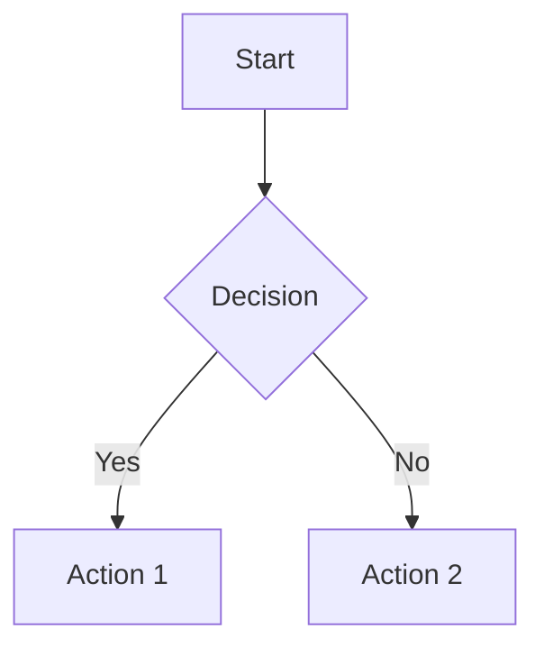
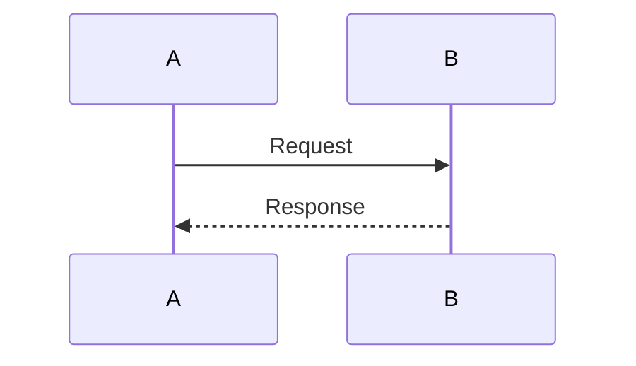
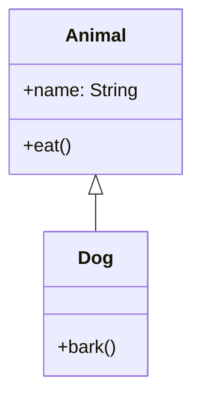

# Architecture Diagrams Guide

This project includes comprehensive architecture diagrams created with **Mermaid** and convertible to **Draw.io** format.

---

## 📊 Available Diagrams

### 1. **Layers Architecture** (`01-layers.mmd`)
Complete overview of all architecture layers:
- UI Layer (Jetpack Compose)
- ViewModel Layer
- Domain Layer (Services)
- Data Layer (Repositories, Data Sources)
- Sync Layer (WorkManager)
- Core Layer (DI, Utilities)

**Shows**: Component relationships, dependency injection, data flow between layers

---

### 2. **Data Flow** (`02-data-flow.mmd`)
Sequence diagram showing complete data flow:
- Online mode - initial load
- User creates new user
- Background sync process
- Cache invalidation events

**Shows**: Step-by-step interaction between components during key operations

---

### 3. **Caching System** (`03-caching-system.mmd`)
Detailed view of the caching architecture:
- LRU caches (Page, UserList, Count)
- Cache invalidation event system
- Event sources and handlers
- TTL management

**Shows**: How caching layer works, event-driven invalidation, cache coherency

---

### 4. **Sync Process** (`04-sync-process.mmd`)
Complete flowchart of the sync operation:
- Network availability check
- Offline change processing
- Multi-page data fetch
- Conflict resolution algorithm
- Database updates
- Cache invalidation

**Shows**: Offline-first sync logic, conflict resolution, error handling

---

### 5. **Repository Pattern** (`05-repository-pattern.mmd`)
Class diagram showing repository implementation:
- DataRepository interface
- OfflineFirstDataRepository
- CachingDataRepository (Decorator pattern)
- Cache event system
- DAOs and network sources

**Shows**: Class relationships, decorator pattern, dependencies

---

### 6. **Dependency Injection** (`06-dependency-injection.mmd`)
Complete Hilt DI structure:
- Hilt modules (Database, Network, Repository, Sync)
- Provided dependencies
- Qualifiers (@OfflineFirst, @Cached)
- Scope management
- Multi-bindings

**Shows**: How all components are wired together via Hilt

---

## 🎨 Viewing Diagrams

### Option 1: View in IDE (VS Code)
1. Install **Mermaid Preview** extension
2. Open any `.mmd` file in `docs/architecture/`
3. Press `Ctrl+Shift+V` (Windows/Linux) or `Cmd+Shift+V` (Mac)

### Option 2: View Online (Mermaid Live)
1. Open https://mermaid.live
2. Copy content from any `.mmd` file
3. Paste into the editor
4. View rendered diagram instantly

### Option 3: Generate PNG Images
```bash
# Install mermaid-cli (one time)
npm install -g @mermaid-js/mermaid-cli

# Generate all diagrams
./gradlew generateMermaidDiagrams
```

Images will be generated at: `app/build/docs/diagrams/*.png`

### Option 4: Import into Draw.io
1. Open https://app.diagrams.net
2. **File → Import from → Mermaid**
3. Select `.mmd` files from `docs/architecture/`
4. Edit and export as needed

---

## 🛠️ Gradle Tasks

### List Available Diagrams
```bash
./gradlew listDiagrams
```

Shows all available Mermaid diagrams with their file paths.

### Generate PNG Diagrams
```bash
./gradlew generateMermaidDiagrams
```

**Requirements**: `npm install -g @mermaid-js/mermaid-cli`

**Generates**:
- High-resolution PNG images (2048x1536)
- Transparent background
- One file per diagram

**Output**: `app/build/docs/diagrams/`

---

## 📝 Editing Diagrams

### Mermaid Syntax

Each diagram uses Mermaid's markdown-like syntax:

#### Graph/Flowchart


#### Sequence Diagram


#### Class Diagram


### Resources
- [Mermaid Documentation](https://mermaid.js.org)
- [Mermaid Live Editor](https://mermaid.live)
- [Syntax Guide](https://mermaid.js.org/intro/syntax-reference.html)

---

## 🔄 Converting to Draw.io

### Method 1: Direct Import
1. Open https://app.diagrams.net
2. **File → Import from → Mermaid**
3. Select `.mmd` file
4. Diagram imports as editable nodes
5. **File → Export as → XML (.drawio)** to save

### Method 2: Via PNG
1. Generate PNG: `./gradlew generateMermaidDiagrams`
2. Open Draw.io
3. **File → Import → Image**
4. Select generated PNG
5. Trace over it or use as reference

### Method 3: Manual Recreation
1. Open `.mmd` file to understand structure
2. Recreate in Draw.io using shapes
3. Benefit: Full control over layout

---

## 📁 File Structure

```
arcanaing/
├── docs/
│   └── architecture/
│       ├── 01-layers.mmd
│       ├── 02-data-flow.mmd
│       ├── 03-caching-system.mmd
│       ├── 04-sync-process.mmd
│       ├── 05-repository-pattern.mmd
│       └── 06-dependency-injection.mmd
├── app/
│   └── build/
│       └── docs/
│           └── diagrams/          # Generated PNGs
│               ├── 01-layers.png
│               ├── 02-data-flow.png
│               └── ...
└── ARCHITECTURE_DIAGRAMS_GUIDE.md  # This file
```

---

## 🎯 Best Practices

### For Viewing
- **Quick Reference**: Use Mermaid Live (no installation)
- **Development**: VS Code with Mermaid Preview
- **Presentations**: Generate PNGs or import to Draw.io
- **Documentation**: Embed `.mmd` files in Markdown (GitHub/GitLab render them)

### For Editing
1. **Small Changes**: Edit `.mmd` files directly
2. **Major Refactoring**: Use Mermaid Live for real-time preview
3. **Complex Layouts**: Import to Draw.io for manual positioning
4. **Version Control**: Keep `.mmd` files (text-based, git-friendly)

### For Sharing
- **Internal**: Share `.mmd` files (developers can view/edit)
- **Stakeholders**: Generate PNGs or Draw.io files
- **Documentation**: Embed in README or wiki
- **Presentations**: Export high-res PNGs

---

## 🚀 Automation

### Generate on Build
To automatically generate diagrams during build:

```kotlin
// In app/build.gradle.kts
tasks.named("assemble") {
    dependsOn("generateMermaidDiagrams")
}
```

**Note**: Requires `mmdc` to be installed

### CI/CD Integration
```yaml
# GitHub Actions example
- name: Install Mermaid CLI
  run: npm install -g @mermaid-js/mermaid-cli

- name: Generate Diagrams
  run: ./gradlew generateMermaidDiagrams

- name: Upload Diagrams
  uses: actions/upload-artifact@v3
  with:
    name: architecture-diagrams
    path: app/build/docs/diagrams/
```

---

## 🔧 Troubleshooting

### "mmdc not found"
**Problem**: `generateMermaidDiagrams` fails

**Solution**: Install mermaid-cli
```bash
npm install -g @mermaid-js/mermaid-cli
```

### Diagram Doesn't Render
**Problem**: Syntax error in `.mmd` file

**Solution**:
1. Open in Mermaid Live to see error
2. Check for:
   - Missing quotes around strings with spaces
   - Unclosed subgraphs
   - Invalid node IDs (use A-Z, 0-9, _)
3. Validate syntax online first

### PNG Quality Issues
**Problem**: Generated PNG is blurry

**Solution**: Adjust dimensions in `build.gradle.kts`:
```kotlin
mmdc -i "\$f" -o "output.png" -w 4096 -H 3072 -b transparent
```

### Can't Import into Draw.io
**Problem**: Import fails or diagram looks wrong

**Solution**:
1. Use latest Draw.io (supports Mermaid import)
2. Try online version: https://app.diagrams.net
3. If still fails, manually recreate using generated PNG as reference

---

## 📚 Additional Resources

### Mermaid
- [Official Docs](https://mermaid.js.org)
- [Live Editor](https://mermaid.live)
- [VS Code Extension](https://marketplace.visualstudio.com/items?itemName=bierner.markdown-mermaid)
- [GitHub Support](https://github.blog/2022-02-14-include-diagrams-markdown-files-mermaid/)

### Draw.io
- [Online Editor](https://app.diagrams.net)
- [Desktop App](https://github.com/jgraph/drawio-desktop/releases)
- [VS Code Extension](https://marketplace.visualstudio.com/items?itemName=hediet.vscode-drawio)

### Architecture Diagrams
- [C4 Model](https://c4model.com) - Architecture diagram standard
- [UML Diagrams](https://www.uml.org) - Standard notation
- [Arc42](https://arc42.org) - Architecture documentation template

---

## 💡 Tips

1. **Keep Diagrams Updated**: Update `.mmd` files when architecture changes
2. **Version Control**: Commit `.mmd` files (text, git-friendly)
3. **Don't Commit PNGs**: Add `app/build/` to `.gitignore` (generated files)
4. **Use Online Tools**: No local installation needed for viewing
5. **Combine Formats**: Mermaid for code-as-documentation, Draw.io for presentations
6. **Document Decisions**: Add notes to diagrams explaining key architectural choices

---

## 🎓 Learning Mermaid

### Quick Start
1. Open https://mermaid.live
2. Try examples from the sidebar
3. Modify and see results instantly
4. Copy syntax that works

### Common Patterns

**Flow Direction**:
- `graph TB` - Top to bottom
- `graph LR` - Left to right
- `graph BT` - Bottom to top
- `graph RL` - Right to left

**Node Shapes**:
- `A[Rectangle]`
- `B(Rounded)`
- `C{Diamond}`
- `D((Circle))`
- `E>Flag]`

**Arrow Types**:
- `-->` Solid arrow
- `-.->` Dotted arrow
- `==>` Thick arrow
- `--x` Cross ending
- `--o` Circle ending

---

**Happy Diagramming!** 🎨

For questions or issues, refer to:
- Mermaid docs: https://mermaid.js.org
- Draw.io help: https://www.drawio.com/doc
- Project README: ../README.md
