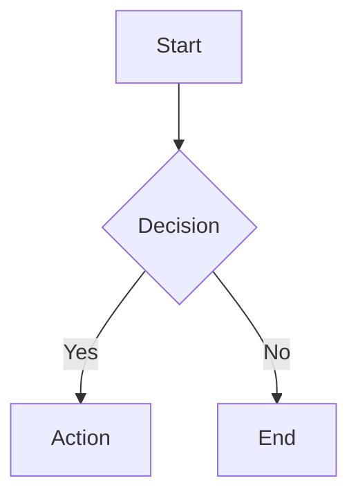
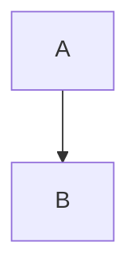

# Documentation Summary

This project has comprehensive documentation automatically generated during the build process.

---

## 📚 What's Included

### 1. API Documentation (Dokka)
- **Format**: HTML
- **Location**: `app/build/docs/api/`
- **Generated**: Automatically during `./gradlew assemble`
- **Content**: All public classes, functions, properties with KDoc comments

### 2. Architecture Diagrams (Mermaid)
- **Format**: Mermaid (`.mmd` files), convertible to PNG and Draw.io
- **Location**: `docs/architecture/`
- **Content**: 6 comprehensive diagrams showing system architecture

---

## 🚀 Quick Start

### View API Documentation
```bash
# Build project (auto-generates docs)
./gradlew assembleDebug

# Open documentation
open app/build/docs/api/index.html
```

### View Architecture Diagrams
```bash
# List available diagrams
./gradlew listDiagrams

# View online (no installation needed)
# 1. Open any .mmd file in docs/architecture/
# 2. Copy content to https://mermaid.live
# 3. View rendered diagram

# Generate PNG images (requires npm)
npm install -g @mermaid-js/mermaid-cli
./gradlew generateMermaidDiagrams
open app/build/docs/diagrams/
```

---

## 📊 Architecture Diagrams

Located in `docs/architecture/`:

1. **01-layers.mmd** - Complete architecture overview
   - All layers: UI, ViewModel, Domain, Data, Sync, Core
   - Component relationships and dependencies

2. **02-data-flow.mmd** - Data flow sequences
   - Online/offline operations
   - CRUD operations
   - Background sync

3. **03-caching-system.mmd** - Caching architecture
   - LRU caches with TTL
   - Event-driven invalidation
   - Cache coherency

4. **04-sync-process.mmd** - Sync process flowchart
   - Offline-first sync logic
   - Conflict resolution
   - Multi-page fetching

5. **05-repository-pattern.mmd** - Repository classes
   - Decorator pattern
   - OfflineFirst + Caching layers
   - Class relationships

6. **06-dependency-injection.mmd** - DI structure
   - Hilt modules
   - Qualifiers and scopes
   - Multi-bindings

**How to Use**:
- **View in IDE**: VS Code with Mermaid Preview extension
- **View Online**: https://mermaid.live (paste `.mmd` content)
- **Generate Images**: `./gradlew generateMermaidDiagrams`
- **Import to Draw.io**: File → Import from → Mermaid

---

## 🛠️ Gradle Tasks

### Documentation Tasks

```bash
# List all documentation tasks
./gradlew tasks --group=documentation
```

Available tasks:

| Task | Description |
|------|-------------|
| `generateApiDocs` | Generate API documentation (HTML) |
| `generateMermaidDiagrams` | Generate diagrams (PNG) from Mermaid |
| `listDiagrams` | List all available Mermaid diagrams |
| `assembleWithDocs` | Build app + generate all documentation |

### Usage Examples

```bash
# Generate only API docs
./gradlew generateApiDocs

# Generate only diagrams (requires mmdc)
./gradlew generateMermaidDiagrams

# Build with all documentation
./gradlew assembleWithDocs

# Normal build (includes API docs automatically)
./gradlew assembleDebug
```

---

## 📁 File Structure

```
aimodeling/
├── docs/
│   └── architecture/
│       ├── README.md                      # Diagrams guide
│       ├── 01-layers.mmd                  # Architecture layers
│       ├── 02-data-flow.mmd               # Data flow
│       ├── 03-caching-system.mmd          # Caching
│       ├── 04-sync-process.mmd            # Sync process
│       ├── 05-repository-pattern.mmd      # Repository pattern
│       └── 06-dependency-injection.mmd    # DI structure
│
├── app/
│   ├── Module.md                          # Module overview (for Dokka)
│   └── build/
│       └── docs/
│           ├── api/                       # Generated API docs (HTML)
│           │   └── index.html             # ← Open this
│           └── diagrams/                  # Generated diagrams (PNG)
│               ├── 01-layers.png
│               ├── 02-data-flow.png
│               └── ...
│
├── ARCHITECTURE.md                        # Architecture overview
├── ARCHITECTURE_DIAGRAMS_GUIDE.md         # Complete diagrams guide
├── API_DOCUMENTATION_SETUP.md             # API docs guide
└── DOCUMENTATION_SUMMARY.md               # This file
```

---

## 🔧 Configuration

### API Documentation
Configured in `app/build.gradle.kts`:

```kotlin
dokka {
    moduleName.set("AI Model Android App")
    dokkaPublications.html {
        outputDirectory.set(layout.buildDirectory.dir("docs/api"))
    }
}
```

**Customize**:
- Module name: Change `moduleName.set(...)`
- Output location: Change `outputDirectory.set(...)`
- Include/exclude packages: Modify `dokkaSourceSets.configureEach { ... }`

### Architecture Diagrams
Mermaid files in `docs/architecture/` are plain text - edit directly.

**Diagram generation configured in** `app/build.gradle.kts`:
```kotlin
tasks.register<Exec>("generateMermaidDiagrams") {
    // Generates PNG from .mmd files
    // Requires: npm install -g @mermaid-js/mermaid-cli
}
```

---

## ✏️ Writing Documentation

### KDoc for API Documentation

Document all public APIs with KDoc:

```kotlin
/**
 * Brief description of the function.
 *
 * Longer description with details, examples, and usage notes.
 *
 * Example:
 * ```kotlin
 * val user = repository.getUser(123)
 * ```
 *
 * @param userId The unique identifier for the user
 * @param includeDetails Whether to include full details
 * @return User object if found, null otherwise
 * @throws NetworkException When network request fails
 * @see UserRepository for repository documentation
 */
suspend fun getUser(userId: Int, includeDetails: Boolean = false): User?
```

### Mermaid Diagrams

Edit `.mmd` files in `docs/architecture/`:



**Test syntax**: Paste into https://mermaid.live

---

## 🌐 Online Tools

### For API Documentation
- **Dokka**: https://kotlinlang.org/docs/dokka-introduction.html
- **KDoc Guide**: https://kotlinlang.org/docs/kotlin-doc.html

### For Architecture Diagrams
- **Mermaid Live**: https://mermaid.live (view/edit diagrams)
- **Mermaid Docs**: https://mermaid.js.org (syntax reference)
- **Draw.io**: https://app.diagrams.net (import Mermaid, export to other formats)

---

## 🔄 Converting Diagrams

### Mermaid → PNG
```bash
npm install -g @mermaid-js/mermaid-cli
./gradlew generateMermaidDiagrams
# Output: app/build/docs/diagrams/*.png
```

### Mermaid → Draw.io
1. Open https://app.diagrams.net
2. **File → Import from → Mermaid**
3. Select `.mmd` files from `docs/architecture/`
4. **File → Export as → XML (.drawio)**

### Mermaid → SVG
```bash
cd docs/architecture
mmdc -i 01-layers.mmd -o 01-layers.svg
```

### Draw.io → PDF/PNG
1. Open `.drawio` file in Draw.io
2. **File → Export as → PDF/PNG**

---

## 📦 CI/CD Integration

### GitHub Actions Example

```yaml
name: Documentation

on: [push, pull_request]

jobs:
  docs:
    runs-on: ubuntu-latest
    steps:
      - uses: actions/checkout@v3

      - name: Set up JDK
        uses: actions/setup-java@v3
        with:
          java-version: '17'

      - name: Generate API Documentation
        run: ./gradlew generateApiDocs

      - name: Install Mermaid CLI
        run: npm install -g @mermaid-js/mermaid-cli

      - name: Generate Architecture Diagrams
        run: ./gradlew generateMermaidDiagrams

      - name: Upload Documentation
        uses: actions/upload-artifact@v3
        with:
          name: documentation
          path: |
            app/build/docs/api/
            app/build/docs/diagrams/

      - name: Deploy to GitHub Pages (optional)
        uses: peaceiris/actions-gh-pages@v3
        if: github.ref == 'refs/heads/main'
        with:
          github_token: ${{ secrets.GITHUB_TOKEN }}
          publish_dir: ./app/build/docs/api
```

---

## 🎯 Best Practices

### API Documentation
1. ✅ Document **all public APIs**
2. ✅ Include **code examples** in complex functions
3. ✅ Link related items with `@see`
4. ✅ Document **exceptions** with `@throws`
5. ✅ Explain **why**, not just what

### Architecture Diagrams
1. ✅ Keep diagrams **up to date** with code changes
2. ✅ Use **consistent naming** across diagrams
3. ✅ Add **notes** for important architectural decisions
4. ✅ Test syntax in **Mermaid Live** before committing
5. ✅ Commit `.mmd` files, not generated PNGs

### General
1. ✅ Update docs when architecture changes
2. ✅ Review docs during code review
3. ✅ Keep documentation **close to code**
4. ✅ Use **version control** for diagram sources
5. ✅ Generate fresh docs before releases

---

## 🆘 Troubleshooting

### API Documentation Not Generated
**Problem**: No `app/build/docs/api/` directory

**Solution**:
```bash
./gradlew clean generateApiDocs
```

### Diagram Generation Fails
**Problem**: `mmdc not found` error

**Solution**: Install Mermaid CLI
```bash
npm install -g @mermaid-js/mermaid-cli
```

### Diagram Syntax Error
**Problem**: Mermaid parsing error

**Solution**:
1. Copy diagram content
2. Paste into https://mermaid.live
3. Fix syntax errors shown
4. Update `.mmd` file

### Can't View Mermaid in GitHub
**Problem**: GitHub doesn't render `.mmd` files

**Solution**: GitHub renders Mermaid in Markdown:
````markdown

````

---

## 📖 Related Documentation

- **[ARCHITECTURE.md](ARCHITECTURE.md)** - Architecture overview
- **[ARCHITECTURE_DIAGRAMS_GUIDE.md](ARCHITECTURE_DIAGRAMS_GUIDE.md)** - Complete diagrams guide
- **[API_DOCUMENTATION_SETUP.md](API_DOCUMENTATION_SETUP.md)** - API docs setup guide
- **[docs/architecture/README.md](docs/architecture/README.md)** - Diagram quick reference

---

## 🎓 Learning Resources

### Dokka (API Documentation)
- [Official Documentation](https://kotlinlang.org/docs/dokka-introduction.html)
- [Dokka Gradle Plugin](https://kotlinlang.org/docs/dokka-gradle.html)
- [KDoc Syntax](https://kotlinlang.org/docs/kotlin-doc.html)

### Mermaid (Architecture Diagrams)
- [Official Documentation](https://mermaid.js.org)
- [Live Editor](https://mermaid.live)
- [Syntax Reference](https://mermaid.js.org/intro/syntax-reference.html)
- [Tutorials](https://mermaid.js.org/ecosystem/tutorials.html)

### Draw.io
- [Online Editor](https://app.diagrams.net)
- [Desktop App](https://github.com/jgraph/drawio-desktop/releases)
- [Tutorials](https://www.drawio.com/doc/)

---

## ✨ Summary

This project includes:

✅ **Automatic API documentation** (Dokka) - Generated on every build
✅ **6 architecture diagrams** (Mermaid) - Source-controlled, convertible to Draw.io
✅ **Gradle tasks** for easy generation
✅ **Online viewing** options (no installation needed)
✅ **CI/CD ready** - Easy to integrate into pipelines

**Next Steps**:
1. Run `./gradlew assembleDebug` to generate API docs
2. Run `./gradlew listDiagrams` to see architecture diagrams
3. Open `app/build/docs/api/index.html` to browse API docs
4. View diagrams at https://mermaid.live

**Happy Documenting!** 📚🎨
