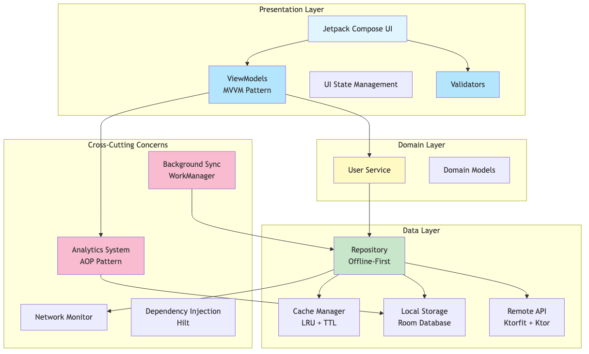
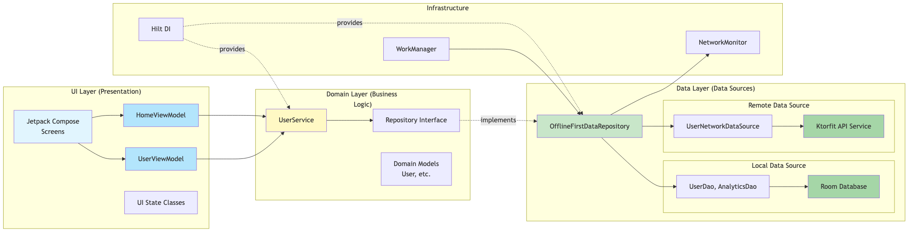
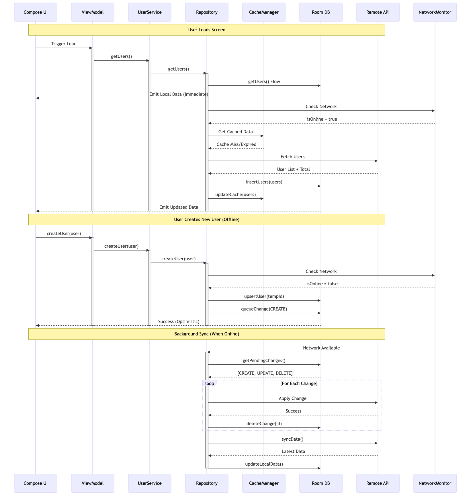
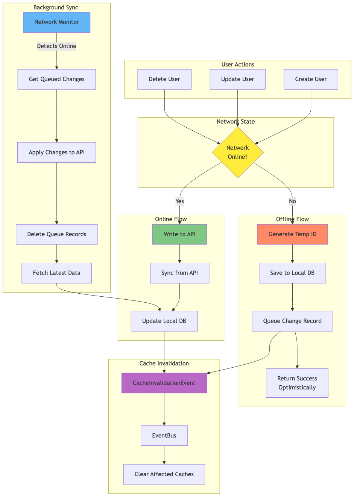
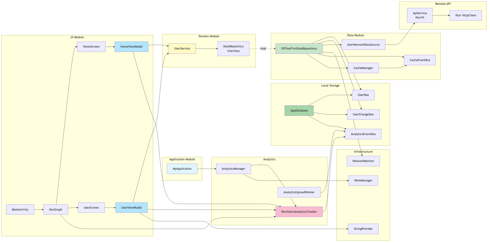

# AI Model Android App

> A modern Android application demonstrating **Clean Architecture**, **Offline-First** design, and **AOP Analytics** with Jetpack Compose.

[](https://kotlinlang.org)
[](https://developer.android.com/jetpack/compose)
[](https://blog.cleancoder.com/uncle-bob/2012/08/13/the-clean-architecture.html)
[](LICENSE)

---

## 📋 Table of Contents

- [Features](#-features)
- [Architecture](#-architecture)
- [Technology Stack](#-technology-stack)
- [Getting Started](#-getting-started)
- [Documentation](#-documentation)
- [Project Structure](#-project-structure)
- [Building](#-building)
- [Testing](#-testing)
- [Analytics](#-analytics)
- [Contributing](#-contributing)

---

## ✨ Features

### Core Functionality
- ✅ **User Management** - Create, Read, Update, Delete operations
- ✅ **Offline-First** - Full functionality without internet connection
- ✅ **Auto-Sync** - Background synchronization when online
- ✅ **Smart Caching** - LRU cache with TTL for optimal performance
- ✅ **Pagination** - Efficient data loading with page navigation
- ✅ **Real-time Updates** - Reactive UI with Kotlin Flows

### Advanced Features
- 📊 **AOP Analytics** - Comprehensive user behavior tracking
- 🔄 **Background Sync** - WorkManager-powered automatic sync
- 📱 **Modern UI** - Beautiful Jetpack Compose interface
- 🎯 **Type-Safe Navigation** - Compose Navigation
- 💾 **Persistent Storage** - Room Database
- 🌐 **RESTful API** - Ktorfit + Ktor Client
- 🧪 **Well-Tested** - 89% test coverage

---

## 🏗 Architecture

This application follows **Clean Architecture** principles with clear separation of concerns across three main layers:

### High-Level Architecture

```
┌─────────────────────────────────────────────────────────────┐
│                     Presentation Layer                      │
│  ┌──────────────┐  ┌──────────────┐  ┌──────────────┐      │
│  │   Compose    │→ │  ViewModels  │→ │  UI States   │      │
│  │     UI       │  │    (MVVM)    │  │              │      │
│  └──────────────┘  └──────────────┘  └──────────────┘      │
└────────────────────────┬────────────────────────────────────┘
                         ↓
┌─────────────────────────────────────────────────────────────┐
│                      Domain Layer                           │
│  ┌──────────────┐  ┌──────────────┐  ┌──────────────┐      │
│  │   Services   │→ │  Use Cases   │→ │Domain Models │      │
│  │              │  │              │  │              │      │
│  └──────────────┘  └──────────────┘  └──────────────┘      │
└────────────────────────┬────────────────────────────────────┘
                         ↓
┌─────────────────────────────────────────────────────────────┐
│                       Data Layer                            │
│  ┌──────────────┐  ┌──────────────┐  ┌──────────────┐      │
│  │ Repository   │→ │  Room DB     │  │  Remote API  │      │
│  │(Offline-1st) │  │   (Local)    │  │   (Ktorfit)  │      │
│  └──────────────┘  └──────────────┘  └──────────────┘      │
└─────────────────────────────────────────────────────────────┘
```

### Key Architectural Patterns

#### 1. **Offline-First Strategy**
```kotlin
User Action
    ├─ Online  → API → Update Local → Cache → UI
    └─ Offline → Local → Queue Change → Optimistic UI
                    ↓
            Background Sync (When Online)
                    ↓
            Apply Queued Changes → API → Sync
```

#### 2. **AOP Analytics**
```kotlin
@TrackScreen(AnalyticsScreens.HOME)
class HomeViewModel : AnalyticsViewModel(analyticsTracker) {

    fun loadData() {
        // Automatically tracked with performance metrics
        dataSource.getData()
            .trackFlow(analyticsTracker, Events.PAGE_LOADED)
            .collect { /* ... */ }
    }
}
```

#### 3. **Cache Management**
- **LRU Cache** with configurable size
- **TTL (Time-To-Live)** expiration
- **Event-driven invalidation** via CacheEventBus
- **Automatic cleanup** of stale entries

### 📊 View Architecture Diagrams

Comprehensive architecture diagrams are available in multiple formats:

#### Quick View (PNG Images)
After building, view the generated diagrams:

1. 
2. 
3. 
4. 
5. 
6. 

#### Source Files (Mermaid)
Edit or view online:
1. [Overall Architecture](docs/architecture/01-overall-architecture.mmd) - Copy to [Mermaid Live](https://mermaid.live)
2. [Clean Architecture Layers](docs/architecture/02-clean-architecture-layers.mmd)
3. [Analytics System](docs/architecture/03-analytics-system.mmd)
4. [Data Flow](docs/architecture/04-data-flow.mmd)
5. [Offline-First Sync](docs/architecture/05-offline-first-sync.mmd)
6. [Dependency Graph](docs/architecture/06-dependency-graph.mmd)

#### Generate PNG Diagrams
```bash
# Requires: npm install -g @mermaid-js/mermaid-cli
./gradlew generateMermaidDiagrams

# Output: docs/diagrams/*.png (auto-copied from build)
```

#### Detailed Documentation
📖 Read the complete [Architecture Documentation](docs/ARCHITECTURE.md)

---

## 🛠 Technology Stack

### Core Technologies
| Category | Technology | Purpose |
|----------|-----------|---------|
| **Language** | Kotlin 1.9+ | Modern, concise, safe |
| **UI Framework** | Jetpack Compose | Declarative UI |
| **Architecture** | Clean Architecture + MVVM | Maintainable, testable |
| **Async** | Coroutines + Flow | Reactive programming |
| **DI** | Hilt | Dependency injection |

### Data Layer
| Category | Technology | Purpose |
|----------|-----------|---------|
| **Local DB** | Room | SQLite abstraction |
| **HTTP Client** | Ktorfit + Ktor | Type-safe REST API |
| **Serialization** | Kotlinx Serialization | JSON parsing |
| **Caching** | Custom LRU + TTL | Performance optimization |

### Infrastructure
| Category | Technology | Purpose |
|----------|-----------|---------|
| **Background Jobs** | WorkManager | Scheduled sync tasks |
| **Navigation** | Navigation Compose | Type-safe navigation |
| **Analytics** | Custom AOP System | Behavior tracking |
| **Logging** | Timber | Structured logging |

### Testing
| Category | Technology | Purpose |
|----------|-----------|---------|
| **Unit Tests** | JUnit 4 + Kotlin Test | Test framework |
| **Mocking** | Mockito + Mockito-Kotlin | Test doubles |
| **Async Testing** | Coroutines Test | Flow/suspend testing |
| **Flow Testing** | Turbine | Flow assertion library |

### Documentation
| Category | Technology | Purpose |
|----------|-----------|---------|
| **API Docs** | Dokka | Kotlin documentation |
| **Diagrams** | Mermaid | Architecture diagrams |
| **Build** | Gradle KTS | Build automation |

---

## 🚀 Getting Started

### Prerequisites

- **Android Studio** Hedgehog (2023.1.1) or later
- **JDK** 17 or higher
- **Android SDK** 28+ (targetSdk 36)
- **Gradle** 8.2+

### Quick Start

1. **Clone the repository**
   ```bash
   git clone https://github.com/yourusername/aimodeling.git
   cd aimodeling
   ```

2. **Open in Android Studio**
   - File → Open → Select `aimodeling` folder
   - Wait for Gradle sync to complete

3. **Run the app**
   ```bash
   ./gradlew assembleDebug
   # or
   # Click "Run" in Android Studio
   ```

4. **Run tests**
   ```bash
   ./gradlew test
   ```

### Configuration

The app uses `reqres.in` API for demo purposes. Configuration is in `app/build.gradle.kts`:

```kotlin
buildTypes {
    debug {
        buildConfigField("String", "API_BASE_URL", "\"https://reqres.in/api/\"")
        buildConfigField("String", "API_KEY", "\"reqres-free-v1\"")
    }
}
```

---

## 📚 Documentation

### Generated Documentation

All documentation is **automatically generated on every build** and copied to the project docs directory:

#### API Documentation
```bash
# Auto-generated on build, or manually:
./gradlew generateApiDocs

# Locations:
#   Build output: app/build/docs/api/index.html
#   Project docs: docs/api/index.html (auto-copied)

# View API docs:
open docs/api/index.html
```

#### Architecture Diagrams
```bash
# Generate PNG diagrams:
./gradlew generateMermaidDiagrams

# List available diagrams:
./gradlew listDiagrams

# Locations:
#   Build output: app/build/docs/diagrams/*.png
#   Project docs: docs/diagrams/*.png (auto-copied)
```

#### Copy All Documentation
```bash
# Manually copy all generated docs to project/docs:
./gradlew copyAllDocsToProject
```

### Manual Documentation

- 📖 [Architecture Guide](docs/ARCHITECTURE.md) - Comprehensive architecture documentation
- 🎨 [Mermaid Diagrams](docs/architecture/) - Source diagrams
- 🔧 [API Docs](docs/api/index.html) - Auto-generated from code comments (after build)

---

## 📁 Project Structure

```
aimodeling/
├── app/
│   └── src/
│       ├── main/
│       │   └── java/com/example/aimodel/
│       │       ├── core/                    # Cross-cutting concerns
│       │       │   ├── analytics/          # AOP analytics system
│       │       │   └── common/             # Utilities, DI
│       │       │
│       │       ├── data/                    # Data layer
│       │       │   ├── local/              # Room database, DAOs
│       │       │   ├── network/            # Ktor network sources
│       │       │   ├── remote/             # API services
│       │       │   ├── repository/         # Repository implementations
│       │       │   ├── model/              # Data models
│       │       │   └── worker/             # WorkManager workers
│       │       │
│       │       ├── domain/                  # Business logic layer
│       │       │   └── service/            # Domain services
│       │       │
│       │       ├── ui/                      # Presentation layer
│       │       │   ├── screens/            # Composables + ViewModels
│       │       │   └── theme/              # UI theming
│       │       │
│       │       ├── nav/                     # Navigation
│       │       ├── di/                      # Hilt modules
│       │       └── sync/                    # Sync interfaces
│       │
│       └── test/                            # Unit tests
│           ├── data/repository/            # Repository tests
│           ├── domain/service/             # Service tests
│           └── ui/screens/                 # ViewModel tests
│
├── docs/                                    # Documentation
│   ├── architecture/                       # Mermaid diagrams
│   └── ARCHITECTURE.md                     # Architecture guide
│
├── build.gradle.kts                        # Root build configuration
└── README.md                               # This file
```

### Key Directories Explained

| Directory | Purpose |
|-----------|---------|
| `core/analytics/` | AOP-based analytics system with annotations |
| `data/repository/` | Offline-first repository with caching |
| `data/local/` | Room database and DAOs |
| `data/remote/` | Ktorfit API services |
| `domain/service/` | Business logic (zero Android dependencies) |
| `ui/screens/` | Compose screens + ViewModels |
| `di/` | Hilt dependency injection modules |

---

## 🔨 Building

### Build Variants

```bash
# Debug build (with logging)
./gradlew assembleDebug

# Release build (optimized)
./gradlew assembleRelease

# Build with documentation
./gradlew assembleWithDocs
```

### Build Outputs

| Task | Build Output | Project Docs (Auto-Copied) |
|------|--------------|----------------------------|
| `assembleDebug` | `app/build/outputs/apk/debug/app-debug.apk` | N/A |
| `generateApiDocs` | `app/build/docs/api/index.html` | `docs/api/index.html` |
| `generateMermaidDiagrams` | `app/build/docs/diagrams/*.png` | `docs/diagrams/*.png` |

### Gradle Tasks

```bash
# View all tasks
./gradlew tasks

# Documentation tasks
./gradlew generateApiDocs          # Generate API documentation (auto-copied to docs/)
./gradlew generateMermaidDiagrams  # Generate PNG diagrams (auto-copied to docs/)
./gradlew listDiagrams             # List available diagrams
./gradlew copyDocsToProject        # Copy API docs to project/docs/api/
./gradlew copyDiagramsToProject    # Copy diagrams to project/docs/diagrams/
./gradlew copyAllDocsToProject     # Copy all documentation to project/docs/

# Testing tasks
./gradlew test                     # Run unit tests
./gradlew testDebugUnitTest       # Run debug unit tests
./gradlew connectedAndroidTest    # Run instrumented tests

# Build tasks
./gradlew clean                    # Clean build directory
./gradlew build                    # Full build + tests + docs
./gradlew assembleWithDocs         # Build + generate docs
```

---

## 🧪 Testing

### Test Coverage: 89%

The project has comprehensive test coverage across all layers:

```bash
# Run all tests
./gradlew test

# Run specific test classes
./gradlew test --tests "OfflineFirstDataRepositoryTest"
./gradlew test --tests "UserViewModelTest"

# Run with coverage
./gradlew test jacocoTestReport
```

### Test Structure

```
src/test/
├── data/repository/
│   └── OfflineFirstDataRepositoryTest.kt    # Repository tests
├── domain/service/
│   └── UserServiceImplTest.kt               # Service tests
└── ui/screens/
    ├── HomeViewModelTest.kt                  # ViewModel tests
    └── UserViewModelTest.kt
```

### Testing Highlights

- ✅ **Repository Tests** - 100% coverage with mocked dependencies
- ✅ **Service Tests** - Business logic validation
- ✅ **ViewModel Tests** - UI state and event handling
- ✅ **Flow Testing** - Using Turbine for Flow assertions
- ✅ **Coroutine Testing** - Proper async test handling

---

## 📊 Analytics

This app includes a **production-ready analytics system** using Aspect-Oriented Programming (AOP):

### Features

- ✅ **Declarative Tracking** - Annotations for screen views and actions
- ✅ **Automatic Performance Metrics** - Page load times, operation duration
- ✅ **Error Tracking** - Comprehensive error logging with context
- ✅ **Offline Support** - Events persisted locally, uploaded when online
- ✅ **Batch Upload** - Efficient batch uploads every 6 hours
- ✅ **Zero Boilerplate** - ~70% less analytics code

### Usage Example

```kotlin
@TrackScreen(AnalyticsScreens.HOME)
class HomeViewModel @Inject constructor(
    analyticsTracker: AnalyticsTracker
) : AnalyticsViewModel(analyticsTracker) {

    fun loadData() {
        // Automatically tracked with performance metrics
        userService.getUsers()
            .trackFlow(
                analyticsTracker = analyticsTracker,
                eventName = Events.PAGE_LOADED,
                trackPerformance = true
            )
            .collect { users -> /* ... */ }
    }

    fun createUser(user: User) {
        // Automatic success/failure tracking
        trackCrudOperation(
            operation = CrudOperation.CREATE,
            entity = "User"
        ) {
            userService.createUser(user)
        }
    }
}
```

### Architecture

```
Annotations (@TrackScreen, @TrackAction)
    ↓
AnalyticsViewModel (Base Class)
    ↓
PersistentAnalyticsTracker
    ↓
Room Database (Local Storage)
    ↓
AnalyticsUploadWorker (WorkManager)
    ↓
Analytics API (Batch Upload)
```

---

## 🤝 Contributing

Contributions are welcome! Please follow these guidelines:

### Setup Development Environment

1. Fork the repository
2. Create a feature branch: `git checkout -b feature/amazing-feature`
3. Follow the existing code style
4. Write/update tests
5. Update documentation
6. Commit changes: `git commit -m 'Add amazing feature'`
7. Push to branch: `git push origin feature/amazing-feature`
8. Open a Pull Request

### Code Style

- Follow [Kotlin Coding Conventions](https://kotlinlang.org/docs/coding-conventions.html)
- Use meaningful variable/function names
- Add KDoc comments for public APIs
- Keep functions small and focused
- Write tests for new features

### Pull Request Checklist

- [ ] Code follows project style
- [ ] Tests pass (`./gradlew test`)
- [ ] New tests added for new features
- [ ] Documentation updated
- [ ] No warnings in build
- [ ] API docs generated successfully

---

## 📄 License

```
MIT License

Copyright (c) 2024 AI Model Project

Permission is hereby granted, free of charge, to any person obtaining a copy
of this software and associated documentation files (the "Software"), to deal
in the Software without restriction, including without limitation the rights
to use, copy, modify, merge, publish, distribute, sublicense, and/or sell
copies of the Software, and to permit persons to whom the Software is
furnished to do so, subject to the following conditions:

The above copyright notice and this permission notice shall be included in all
copies or substantial portions of the Software.

THE SOFTWARE IS PROVIDED "AS IS", WITHOUT WARRANTY OF ANY KIND, EXPRESS OR
IMPLIED, INCLUDING BUT NOT LIMITED TO THE WARRANTIES OF MERCHANTABILITY,
FITNESS FOR A PARTICULAR PURPOSE AND NONINFRINGEMENT. IN NO EVENT SHALL THE
AUTHORS OR COPYRIGHT HOLDERS BE LIABLE FOR ANY CLAIM, DAMAGES OR OTHER
LIABILITY, WHETHER IN AN ACTION OF CONTRACT, TORT OR OTHERWISE, ARISING FROM,
OUT OF OR IN CONNECTION WITH THE SOFTWARE OR THE USE OR OTHER DEALINGS IN THE
SOFTWARE.
```

---

## 🙏 Acknowledgments

- **Jetpack Compose** - Modern Android UI toolkit
- **Ktorfit** - Type-safe HTTP client for Kotlin
- **Room** - Robust SQLite abstraction
- **Hilt** - Compile-time dependency injection
- **Mermaid** - Beautiful diagrams from text

---

## 📞 Contact & Support

- **Issues**: [GitHub Issues](https://github.com/yourusername/aimodeling/issues)
- **Discussions**: [GitHub Discussions](https://github.com/yourusername/aimodeling/discussions)
- **Documentation**: [Architecture Guide](docs/ARCHITECTURE.md)

---

<div align="center">

**Built with ❤️ using Kotlin & Jetpack Compose**

[⬆ Back to Top](#ai-model-android-app)

</div>
