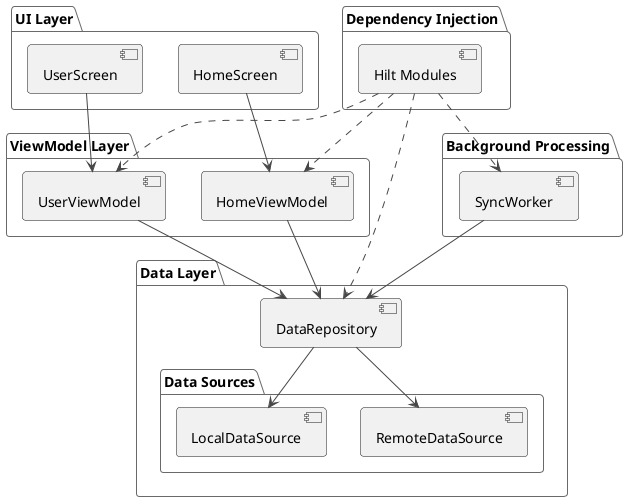

# Software Architecture

This document describes the software architecture of the aimodel application.

## Overview

The application follows the [MVVM (Model-View-ViewModel)](https://developer.android.com/topic/architecture/ui-layer/viewmodels) architectural pattern and is structured based on the principles of [Clean Architecture](https://blog.cleancoder.com/uncle-bob/2012/08/13/the-clean-architecture.html). This separation of concerns makes the codebase modular, scalable, and easy to maintain.

The architecture is divided into the following layers:

-   **UI Layer**: Displays the application data on the screen and handles user interactions.
-   **ViewModel Layer**: Holds and manages UI-related data in a lifecycle-conscious way.
-   **Data Layer**: Responsible for providing data to the application from various sources like network and local database.
-   **Domain Layer**: (Implicit) Contains the business logic of the application. While not a separate package, the interaction between ViewModels and Repositories can be considered part of this layer.

## Layers

### UI Layer

The UI layer is built using [Jetpack Compose](https://developer.android.com/jetpack/compose), a modern toolkit for building native Android UI. It consists of:

-   **Screens**: Composable functions that represent a single screen in the app (e.g., `HomeScreen`, `UserScreen`).
-   **Theme**: Defines the visual appearance of the application, including colors, typography, and shapes.

### ViewModel Layer

The ViewModel layer acts as a bridge between the UI and the Data layer. It is responsible for:

-   Holding and managing UI-related data.
-   Surviving configuration changes (e.g., screen rotations).
-   Calling the Data layer to fetch and update data.

Each screen has a corresponding ViewModel (e.g., `HomeViewModel`, `UserViewModel`).

### Data Layer

The Data layer is responsible for providing data to the application. It consists of:

-   **Repositories**: Expose data to the rest of the app. They are responsible for abstracting the data sources (network, database).
-   **Data Sources**:
    -   **Remote**: Handles data from the network using a REST API (e.g., using Retrofit).
    -   **Local**: Manages data stored on the device using a local database (e.g., using Room).
-   **Models**: Represent the data used in the application.

### Dependency Injection

The application uses [Hilt](https://developer.android.com/training/dependency-injection/hilt-android) for dependency injection. This allows for a more modular and testable codebase. The `di` package contains Hilt modules for providing dependencies for different parts of the application.

### Background Processing

The application uses [WorkManager](https://developer.android.com/topic/libraries/architecture/workmanager) for background tasks like data synchronization. The `sync` package contains the `SyncWorker` which is responsible for this task.

## UML Diagram (PlantUML)

