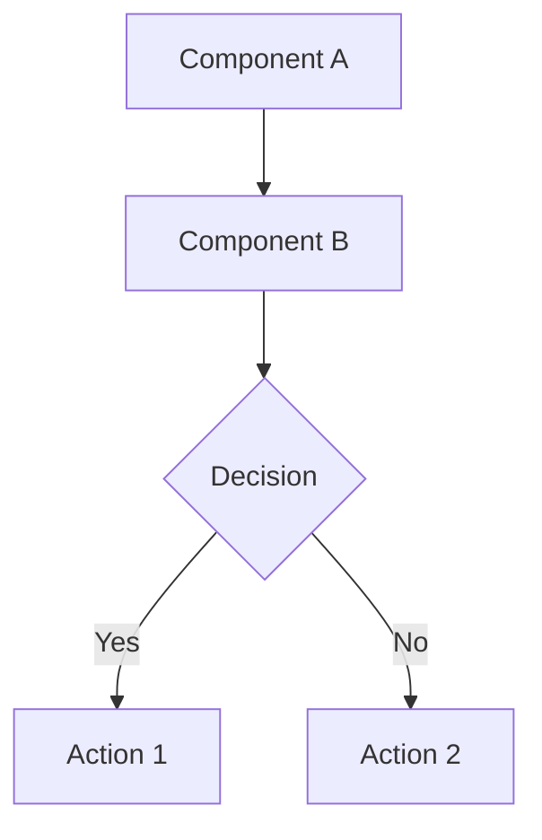

# Architecture Diagrams

This directory contains Mermaid diagrams documenting the application's architecture.

## Quick Links

- **View Online**: Copy any `.mmd` file content to [Mermaid Live](https://mermaid.live)
- **Import to Draw.io**: [app.diagrams.net](https://app.diagrams.net) → File → Import from → Mermaid
- **Generate PNGs**: Run `./gradlew generateMermaidDiagrams` from project root

## Diagrams

| File | Description | Type |
|------|-------------|------|
| `01-layers.mmd` | Complete architecture layers and components | Graph |
| `02-data-flow.mmd` | Data flow through the system | Sequence |
| `03-caching-system.mmd` | Caching architecture and events | Graph |
| `04-sync-process.mmd` | Offline-first sync flowchart | Flowchart |
| `05-repository-pattern.mmd` | Repository class relationships | Class Diagram |
| `06-dependency-injection.mmd` | Hilt DI structure | Graph |

## Usage

### View in VS Code
1. Install **Mermaid Preview** extension
2. Open any `.mmd` file
3. Press `Ctrl+Shift+V` or `Cmd+Shift+V`

### View Online
```bash
# Copy file content
cat 01-layers.mmd | pbcopy  # macOS
cat 01-layers.mmd | xclip    # Linux

# Open https://mermaid.live and paste
```

### Generate PNG Images
```bash
# Install mermaid-cli (one time)
npm install -g @mermaid-js/mermaid-cli

# Generate all diagrams
cd ../../  # Project root
./gradlew generateMermaidDiagrams

# Output: app/build/docs/diagrams/*.png
```

### Convert to Draw.io
1. Open https://app.diagrams.net
2. **File → Import from → Mermaid**
3. Select `.mmd` files from this directory
4. Edit as needed
5. **File → Export as → XML (.drawio)**

## Editing

Edit `.mmd` files directly in any text editor. Syntax:



**Resources**:
- [Mermaid Syntax](https://mermaid.js.org/intro/syntax-reference.html)
- [Live Editor](https://mermaid.live) - Real-time preview
- [Examples](https://mermaid.js.org/ecosystem/tutorials.html)

## Maintenance

When architecture changes:
1. Update corresponding `.mmd` file(s)
2. Test syntax at https://mermaid.live
3. Commit updated `.mmd` files
4. (Optional) Regenerate PNGs with `./gradlew generateMermaidDiagrams`

**Note**: Don't commit generated PNG files - they're in `app/build/` which is gitignored.

---

For complete guide, see [ARCHITECTURE_DIAGRAMS_GUIDE.md](../../ARCHITECTURE_DIAGRAMS_GUIDE.md)
